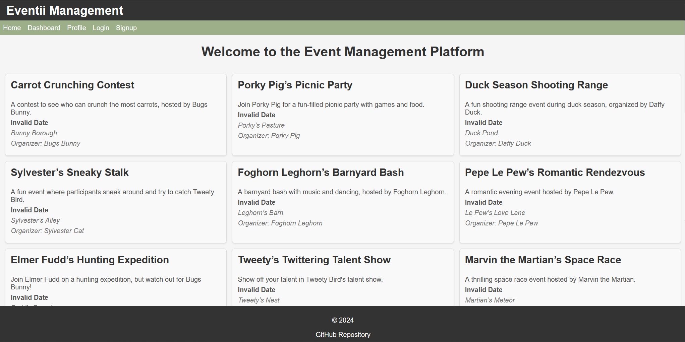

# Eventii-Management-Platform

A full-stack event management application using the MERN stack.

## Table of Contents
- [Features](#features)
- [Technologies Used](#technologies-used)
- [Setup](#setup)
- [Deployment](#deployment)
- [Usage](#usage)
- [Contributing](#contributing)
- [License](#license)

## Image

## Features

- User authentication (sign up, login, logout) with JWT.
- Event CRUD operations (create, read, update, delete).
- Event registration for users.
- Event search and filter.
- User profiles with event history.
- Integration with Stripe for event fees or donations.
- PWA functionality (offline access, installable).

## Technologies Used

### Backend

- Node.js
- Express
- MongoDB
- Mongoose
- Apollo Server
- GraphQL
- JWT
- Stripe

### Frontend

- React
- Apollo Client
- GraphQL
- React Router

## Setup

### Backend

1. Clone the repository.
2. Navigate to the `backend` directory.
3. Install dependencies: `npm install`.
4. Create a `.env` file and add your environment variables.
5. Start the server: `npm run dev`.

### Frontend

1. Clone the repository.
2. Navigate to the `frontend` directory.
3. Install dependencies: `npm install`.
4. Create a `.env` file and add your environment variables.
5. Start the development server: `npm start`.

## Deployment

The application is deployed using Render for both frontend and backend.

[Deployed Link](https://eventii-management-platform-l6xt.onrender.com/) 

[Repository Link](https://github.com/yahm0/Eventii-Management-Platform) 

## Usage

- Visit the application URL.
- Sign up or log in.
- Create, view, update, and delete events.
- Register for events.
- View and manage user profiles.

## Contributing

Feel free to fork this repository and submit pull requests.

## License

This project is licensed under the MIT License.
